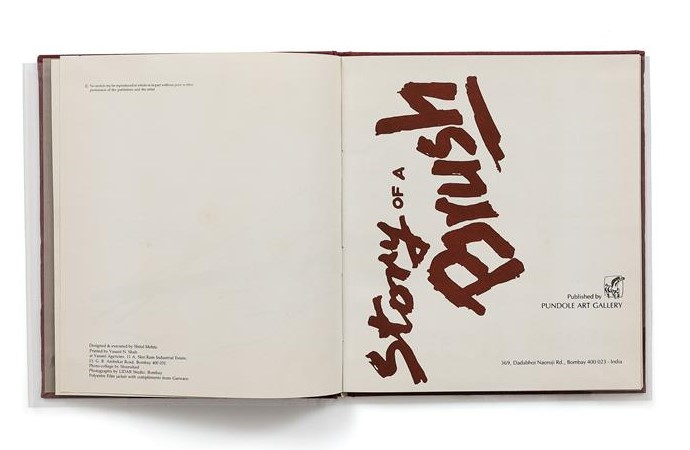
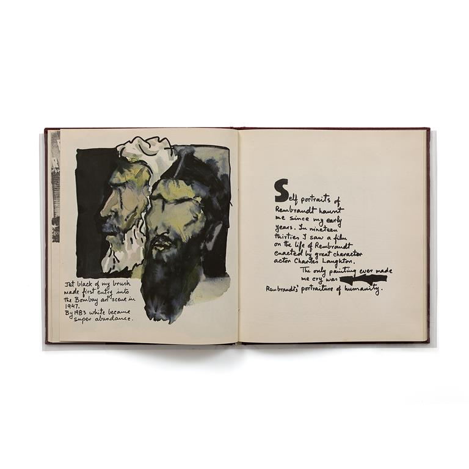
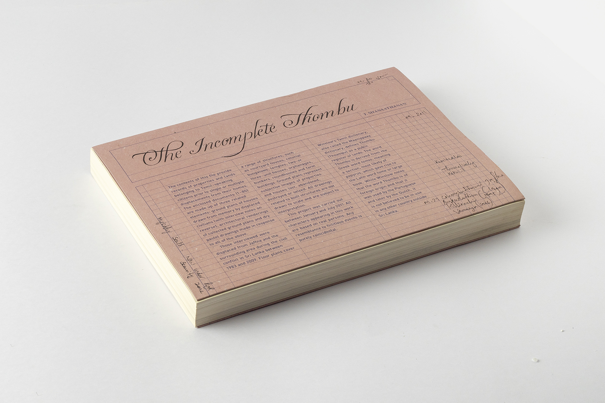
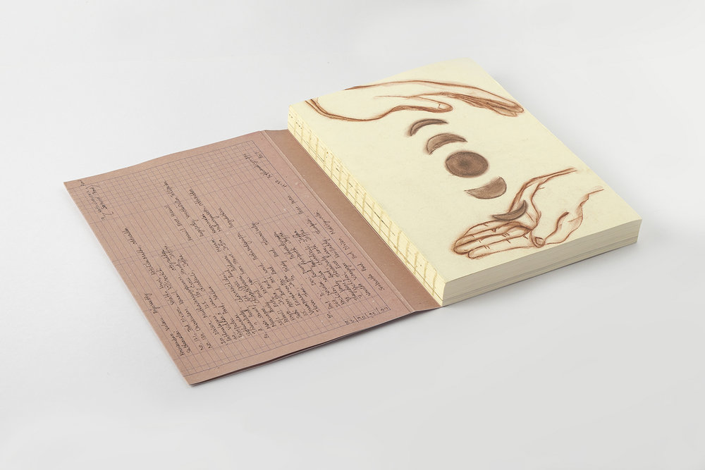

## "If the small voice of history gets a hearing at all...it will do so only by interrupting the telling in the dominant version, breaking up its storyline and making a mess of its plot." 

### - Ranajit Guha, ["The Small Voice of History"](https://archive.org/details/in.ernet.dli.2015.149176/page/n2/mode/1up)

---

## The Question of History

The preceding quote comes from Ranajit Guha's seminal essay "The Small Voice of History," in which he identifies the narrative structure of typical history writing as essentially colonial, statist, and oppressive. To truly write a postcolonial history, one must embrace "a certain disorderliness," a willingness to embrace multivocality, ambiguity, and messiness over a singular, nationalist story. 

My thesis considers two artists books, M.F. Husain's <i>Story of a Brush</i> and Thamotharampillai Shanaathanan's <i>The Incomplete Thombu</i> as exemplars of this alternative historical method, providing insight into how art and text can work together to provide novel insight into how to represent the complexity of modern South Asian history. Both books come from the perspectives of religious minorities navigating oppression and violence, while also commemorating their community's resilience, creativity, and culture. In analyzing these two books, I hope to draw attention to the significance of the artists book as a unique repository for memory and creative expression outside of nationalist historical narratives.  

## Story of a Brush
#### M.F. Husain

Published by the Pundole Gallery in 1983, <i>Story of a Brush</i> commemorates Maqbool Fida Husain's twenty-year relationship with the gallery. Part autobiography, part philososphical meditation, and part marketing material, <i>Story of a Brush</i> is a distinct and difficult-to-define book that starkly contrasts with the typical notion that artists books are created outside of institutional settings and the art market. The book tells the story of Husain's life and art career in his characteristically ambiguous fashion, often anthropomorphizing the brush itself. <i>Story of a Brush</i> is a key example of Husain's interest in writing his own art history, one that eschews any easy definitions of his own identity. 

## The Incomplete Thombu

A <i>thombu</i> (or <i>tombo</i>) was a type of record book used by Portugese and Dutch colonial governments, one which recorded demographic information about families, their land holdings, their caste, required service to the sovereign, and occupation. Shanaathanan's <i>thombu,</i> published in 2011, tells the stories of eighty anonymous Northern Sri Lankan Tamils and Muslims displaced by the Sri Lankan Civil War, a subversive reinterpretation of the colonial document that foregrounds its incompleteness. Shanaathanan asked each participant to draw a layout of the home they lost in the war. As they drew, he recorded their stories and memories of life before the war and/or the circumstances of their displacement. Each entry in the <i>thombu</i> consists of the hand-drawn layout, a printed architectural rendering based on the drawing, an excerpt from the conversation about home, and Shanaathanan's own interpretation of their story, rendered in a drawing. Each entry commemorates the forgotten home and dissects the historial process, showing record-creation, modification, and interpretation. 