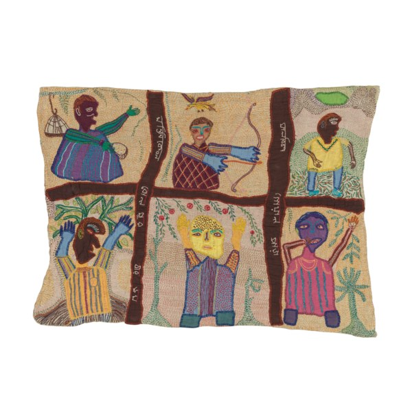
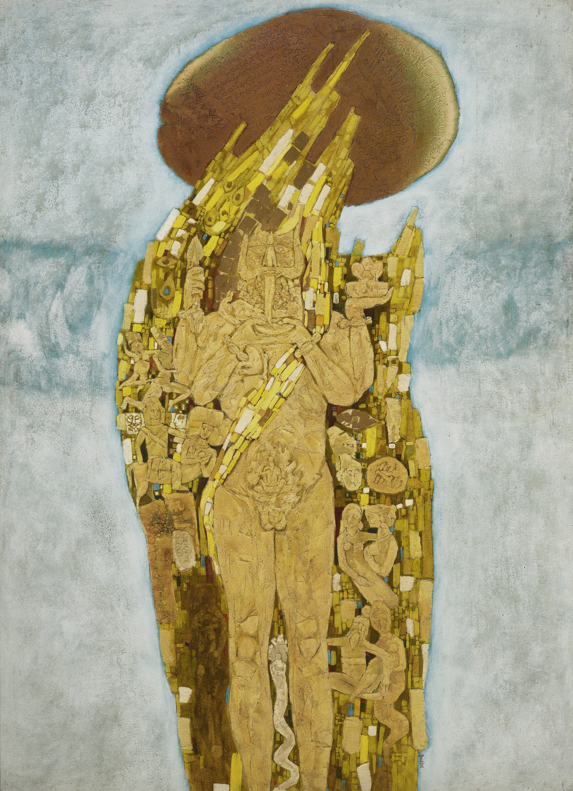
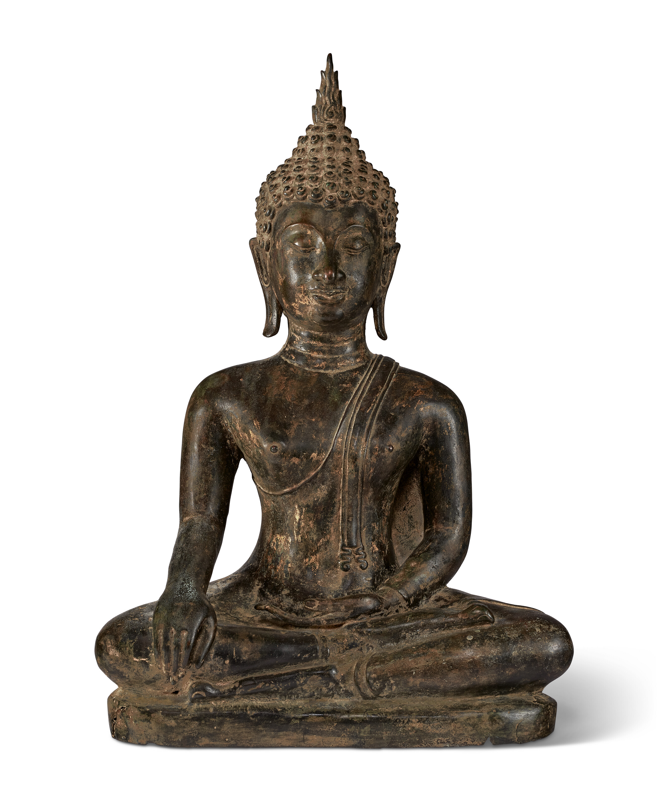

## South Asian Modern + Contemporary 

 
[Two Women and the Swan](https://www.christies.com/lot/lot-6359061?ldp_breadcrumb=back&intObjectID=6359061&from=salessummary&lid=1)
 Executed by Jogen Chowdhury in 1995.  Sold in the South Asian Modern + Contemporary Sale for $201,600 in March 2022.

 
[Untitled (Construction)](https://www.christies.com/lot/lot-6359064?ldp_breadcrumb=back&intObjectID=6359064&from=salessummary&lid=1)
 Executed by K.K. Hebbar in 1962.  Sold in the South Asian Modern + Contemporary Sale for $126,000 in March 2022.

  
[Text Decoded II](https://www.christies.com/lot/lot-6359064?ldp_breadcrumb=back&intObjectID=6359064&from=salessummary&lid=1)
 Executed by Jagdish Swaminathan in 1993.  Sold in the South Asian Modern + Contemporary Sale for $302,400 in March 2022.

 
[Scripted in Time II](https://www.christies.com/lot/lot-6359083?ldp_breadcrumb=back&intObjectID=6359083&from=salessummary&lid=1)
 Executed by Rameshwar Broota in 1995.  Sold in the South Asian Modern + Contemporary Sale for $302,400 in March 2022.

 
[Untitled (Red Balloon)](https://www.christies.com/en/lot/lot-6359131)
 Executed by Bikash Bhattacharjee.  Sold in the South Asian Modern + Contemporary Sale for 126,000 in March 2022.

 
[Untitled](https://onlineonly.christies.com/s/south-asian-modern-contemporary-art-online/meera-mukherjee-1923-1998-16/142951?ldp_breadcrumb=back)
 Executed by Meera Mukherjee.  Sold in the South Asian Modern + Contemporary Online Sale for 20,160 in March 2022.

 
[Untitled (Mahakala)](https://onlineonly.christies.com/s/south-asian-modern-contemporary-art-online/arup-das-1924-2004-54/142970?ldp_breadcrumb=back)
 Executed by Arup Das.  Sold in the South Asian Modern + Contemporary Online Sale for 10,080 in March 2022.

## Indian, Himalayan, & Southeast Asian

 
[A Large Bronze Figure of Padmasambhava](https://www.christies.com/lot/lot-6362044?ldp_breadcrumb=back&intObjectID=6362044&from=salessummary&lid=1)
 Executed by a Tibetan artist in the 18th century.  Sold in the Indian, Himalayan, and Southeast Asian Works of Art Sale for 27,720 in March 2022.

 
[A Rare Mottled Red Sandstone Lion Capital](https://www.christies.com/lot/lot-6362061?ldp_breadcrumb=back&intObjectID=6362061&from=salessummary&lid=1)
 Executed by an Indian (Mathura) artist in the 2nd century.  Sold in the Indian, Himalayan, and Southeast Asian Works of Art Sale for 27,720 in March 2022.

 
[A Red Sandstone Frieze with Musicians](https://www.christies.com/lot/lot-6362063?ldp_breadcrumb=back&intObjectID=6362063&from=salessummary&lid=1)
 Executed by an Indian (Mathura) artist in the 2nd century.  Sold in the Indian, Himalayan, and Southeast Asian Works of Art Sale for 27,720 in March 2022.

 
[A Buff Sandstone Doorjamb with River Goddess and Attendant](https://www.christies.com/lot/lot-6362064?ldp_breadcrumb=back&intObjectID=6362064&from=salessummary&lid=1)
 Executed by an Indian (Rajasthan or Madhya Pradesh) artist in the 10th-11th century.  Sold in the Indian, Himalayan, and Southeast Asian Works of Art Sale for 25,200 in March 2022.

 
[A Bronze Figure of Shiva](https://www.christies.com/lot/lot-6362071?ldp_breadcrumb=back&intObjectID=6362071&from=salessummary&lid=1)
 Executed by an Indian (Tamil Nadu) artist in the 17th century.  Sold in the Indian, Himalayan, and Southeast Asian Works of Art Sale for 37,800 in March 2022.

 
[A Rare Stone Head of Buddha](https://www.christies.com/lot/lot-6362075?ldp_breadcrumb=back&intObjectID=6362075&from=salessummary&lid=1)
 Executed by a Thai artist in the 8th-9th century.  Sold in the Indian, Himalayan, and Southeast Asian Works of Art Sale for 44,100 in March 2022.

 
[A Bronze Figure of Buddha](https://www.christies.com/lot/lot-6362077?ldp_breadcrumb=back&intObjectID=6362077&from=salessummary&lid=1)
 Executed by a Thai artist in the 13th-14th century.  Sold in the Indian, Himalayan, and Southeast Asian Works of Art Sale for 12,600 in March 2022.

 
[A Painting of a Purushkara Yantra](https://www.christies.com/lot/lot-6362109?ldp_breadcrumb=back&intObjectID=6362109&from=salessummary&lid=1)
 Executed by an Indian (Rajasthan or Gujarat) artist in the 18th century.  Sold in the Indian, Himalayan, and Southeast Asian Works of Art Sale for 15,120 in March 2022.

## Modern & Impressionist 

 
[Vase de Fleurs](https://www.christies.com/lot/lot-6369515?ldp_breadcrumb=back&intObjectID=6369515&from=salessummary&lid=1)
 Executed by Odilon Redon.  Sold in the Impressionist & Modern Works on Paper and Day Sale for $504,000 in May 2022.